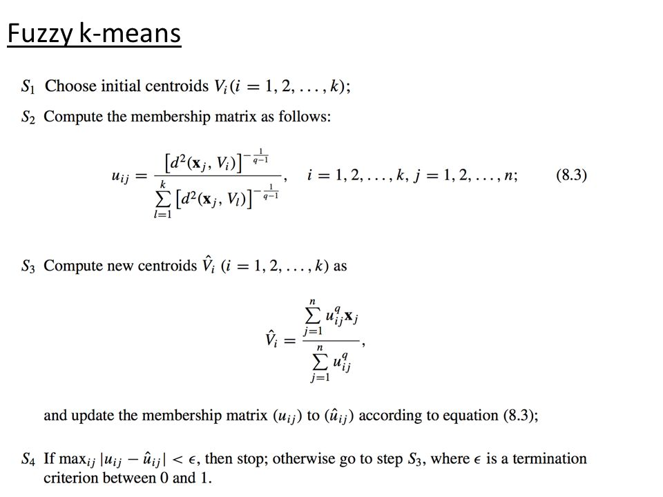

# Brain-Tumor-Segmentation
### Abstract
Medical Science in Image Processing is an emerging field which has proposed a lot of advanced techniques in detection and analysis of a particular disease. Treatment of tumor is becoming more challenging due to more complex structure,shape and texture of the tumor.The advancement in this field created an urge to research on the techniques developed for tumor extraction. Fuzzy c-means (FCM) is one of the prominent method utilized for medical image segmentation.
### Fuzzy c-means
The fuzzy c-means clustering (FCM), introduced by Bezdek, is a popular clustering algorithm which works on the idea of belongingness of a given data point to more than one cluster. After clustering, all the obtained c clusters are represented as fuzzy sets F = {F1, F2, F3,...,Fc} defined on the data points X = {x1, x2, x3,...,xn}.
### Preliminaries
#### Definition 1 Fuzzy set: 
A Fuzzy set is a set in which each member element will have the
fractional membership via a membership function μA : X → [0, 1] which give its degree
of belongingness . If A is a fuzzy set defined over a set X, it can be represented as:
                     A = {(x, μA(x)) : x ∈ X}
 

